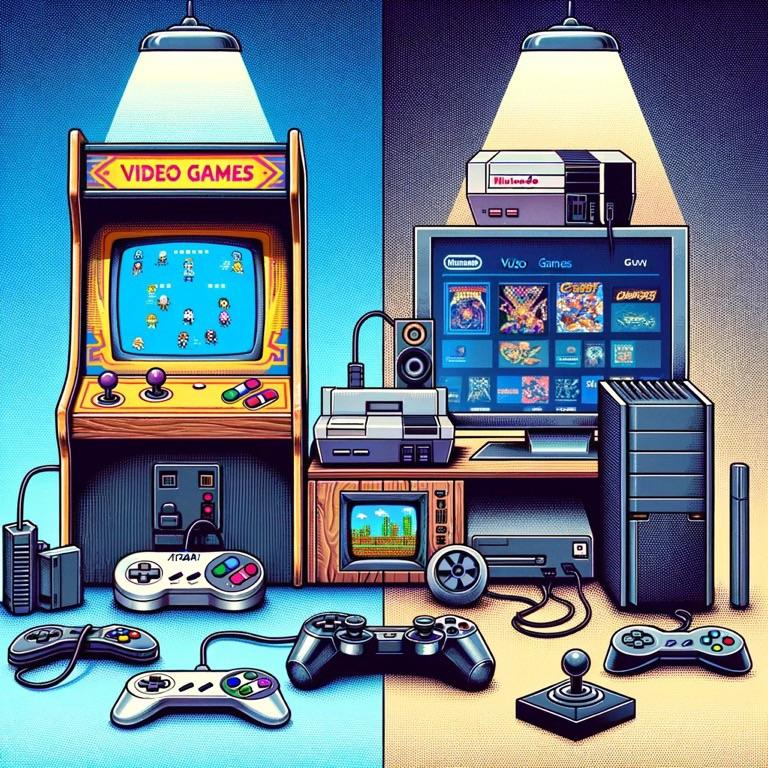

<a name="readme-top"></a>

<!-- PROJECT SHIELDS -->

[![Contributors][contributors-shield]][contributors-url]

<!-- PROJECT LOGO -->
<br />
<div align="center">
  <a href="https://github.com/nagmil2077/videogame-database">
    
  </a>

<h3 align="center">Videogame Database Project</h3>

  <p align="center">
    Pet project - Solo work
    <br />
    <a href="https://github.com/nagmil2077/videogame-database"><strong>Explore the docs »</strong></a>
    <br />
    <br />
  </p>
</div>

<!-- ABOUT THE PROJECT -->

## About The Project

[![Product Name Screen Shot][product-screenshot]](https://github.com/nagmil2077/videogame-database)

This project is still work-in-progress and was created for educational purposes.\
The main goal of this project was to create a video game database website that allows users to browse a rich collection
of games, display multiple information from them, and add them to favorites.\
The current state of the project was created under a 3-week sprint.
It contains two projects, one for the frontend and one for the backend.\
The frontend was created with React, the backend is handled using Laravel, and the database was established using MySQL.\
The project currently displays video games fetched from an API serivice, it has a search feature, and
also has Register/Login features as well.

<p align="right">(<a href="#readme-top">back to top</a>)</p>

### Built With

* [![Github][Github]][Github-url]
* [![PHP][PHP]][Php-url]
* [![Laravel][Laravel]][Laravel-url]
* [![Javascript][Javascript]][Javascript-url]
* [![React][React.js]][React-url]
* [![MySQL][MySQL]][MySQL-url]
* [![PhpStorm][PhpStorm]][PhpStorm-url]
* [![HTML5][HTML5]][HTML5-url]
* [![CSS][CSS]][CSS-url]

<p align="right">(<a href="#readme-top">back to top</a>)</p>

<!-- GETTING STARTED -->

## Getting Started

You can clone the project and install it to see it in action.

### Prerequisites

* [Composer](https://getcomposer.org/)
* [PHP 8](https://www.php.net/downloads.php)
* [Laravel](https://laravel.com/)
* [Node.js 16+](https://nodejs.org/en)
* [MySQL](https://www.mysql.com/)

### Installation

1. Create MySQL Database
- Install MySQL if not already installed.
- Create a new database on the MySQL server in your computer terminal (launching MySQL with your username), using the following commands:
```sql
mysql -u Your_DB_Username -p
```
```sql
CREATE DATABASE videogame_db;
```
2. Clone the repo.
```sh
git clone https://github.com/nagmil2077/videogame-database.git
```
3. Backend setup:
- Navigate to the backend directory.
- Install PHP dependencies using Composer.
```sh
composer install
```
- Set up environment variables:
  - Copy the example environment file.
  ```sh
  cp .env.example .env
  ```
  - Update .env with your database credentials and other settings. The database should be `videogame_db`.
- Run database migrations.
```sh
php artisan migrate
```
4. Frontend setup:
- Navigate to the frontend directory.
- Install JavaScript dependencies using npm.
```sh
npm install
```
5. Start the development servers
- Navigate to the backend folder and start the backend server using the following command:
```sh
php artisan serve
```
- Navigate to the frontend folder in another terminal and start the frontend development server:
```sh
npm start
```
6. Open the frontend in your web browser.

<p align="right">(<a href="#readme-top">back to top</a>)</p>

<!-- CONTACT -->
## Contact

Milan Nagy - [github](https://github.com/nagmil2077) - [linkedin](https://www.linkedin.com/in/milan-nagy-a76b1416a/) - corey321@gmail.com

Project Link: [https://github.com/nagmil2077/videogame-database](https://github.com/nagmil2077/videogame-database)

<p align="right">(<a href="#readme-top">back to top</a>)</p>

<!-- MARKDOWN LINKS & IMAGES -->
<!-- https://www.markdownguide.org/basic-syntax/#reference-style-links -->

[contributors-shield]: https://img.shields.io/github/contributors/othneildrew/Best-README-Template.svg?style=for-the-badge
[contributors-url]: https://github.com/CodecoolGlobal/el-proyecte-grande-design-general-nagmil2077/graphs/contributors
[linkedin-shield]: https://img.shields.io/badge/-LinkedIn-black.svg?style=for-the-badge&logo=linkedin&colorB=555
[linkedin-url]: https://www.linkedin.com/in/milan-nagy-a76b1416a/
[product-screenshot]: images/site.png

<!-- STACKS -->
[React.js]: https://img.shields.io/badge/React-20232A?style=for-the-badge&logo=react&logoColor=61DAFB
[React-url]: https://reactjs.org/
[MySQL]: https://shields.io/badge/MySQL-lightgrey?logo=mysql&style=plastic&logoColor=white&labelColor=blue
[MySQL-url]: https://www.mysql.com/
[PhpStorm]: https://img.shields.io/badge/PhpStorm-000000.svg?style=for-the-badge&logo=phpstorm&logoColor=white
[PhpStorm-url]: https://www.jetbrains.com/phpstorm/
[Github]: https://img.shields.io/badge/GitHub-100000?style=for-the-badge&logo=github&logoColor=white
[Github-url]: https://github.com
[PHP]: https://img.shields.io/badge/PHP-ED8B00?style=for-the-badge&logo=php&logoColor=white
[Php-url]: https://www.php.net/
[Laravel]: https://img.shields.io/badge/Laravel-6DB33F?style=for-the-badge&logo=laravel&logoColor=white
[Laravel-url]: https://laravel.com/
[Javascript]: https://img.shields.io/badge/JavaScript-F7DF1E?style=for-the-badge&logo=javascript&logoColor=black
[Javascript-url]: https://www.javascript.com
[CSS]: https://img.shields.io/badge/CSS-239120?&style=for-the-badge&logo=css3&logoColor=white
[CSS-url]: https://developer.mozilla.org/en-US/docs/Web/CSS
[HTML5]: https://img.shields.io/badge/HTML5-E34F26?style=for-the-badge&logo=html5&logoColor=white
[HTML5-url]: https://en.wikipedia.org/wiki/HTML5
